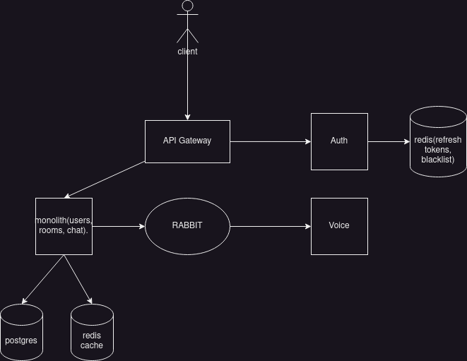

# Glimmer back end

This is how the glimmer back end infrastructure will be composed

## Services

-   [API](#API)
-   [Voice server](#voice-server)

### Auth server

This server handles token issuing, refreshing, rotation and token blacklist.

### API

This server will handle all the communication with the client. Most of it will be done trough websockets. For both the sockets and the rest API we'll be using [uWebsockets](https://github.com/uNetworking/uWebSockets) for a better performance.

It is going to be responsible for:

-   [Anonymous Auth](./auth.md)
-   Save user profile and config
-   Following and dms
-   Room management

About the user profiles, the users will actually have a minimal profile. Basically, the user will store its data locally and when connecting it'll send it to the server. We will store it on Redis and delete it when the users leaves the ws connection. To authenticate the user we'll use jwt tokens and attached a unique id which identifies him.

### Voice server

This server will handle the rooms creation and deal with all the producers(send audio)/consumers(receive audio). Since we are dealing with group calls, we are implementing SFU servers with mediasoup.

The room creation, deletion, etc, will be triggered from the api server trough rabbitmq.

## Deployment and scale

[go here](./scaling.md)