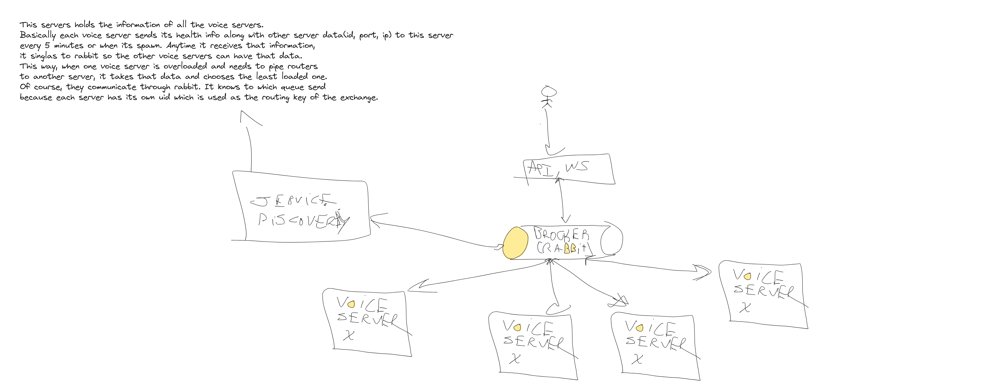

## Scaling

For now, We will develop a voice server with minimal scaling concerns, that is, we'll do a manual calculation of each worker capacity and based on its current capacity we'll decide whether piping routers its needed for a given room, etc. If on that process the server finds that there is no more capacity we just return an error, we won't be doing more scaling more than that, principally for time and also because we don't want to spend our initial resources in the firsts phases of the app.

Later on, if we do actually need to scale, we'll take an horizontal scaling approach. Of course we still need time to develop a good solution. But probably we'll need to create a new service that manages the routing to the voice servers based on their usage. Also, when one room needs more power we'll transfer its new peers to another physical machine and pipe them with mediasoup routers. And we'll probably implement kubernetes to automatically ship new servers based on the usage.

Finally, we will need to implement monitors and loggers such as, Prometheus and grafana to get a better numbers of the machine cpu usage.

### Posible future solution 

See below a quick map of the future scalability infrastructure:

Right now, the API keeps track of the room and its corresponding voice server. For that, when creating a room, the API publishes to a general (round-robin) exchange that all voice servers listen and the voice server that consumes the message publish another message with the room details as long with its id. Those voice servers that have a high load stop consuming the general exchange until their load gets reduced.

Then, each voice server will be consuming a queue with its own id(auto-generated and stored in a file in case the server goes down). When the API needs to publish to the voice server it will use the id sent when creating the room.

When we need to scale further more, we'll probably have a smarter routing having a new service where voice servers would register themselves and periodically send their usage stats(number of rooms, consumers and producers, cpu usage, etc). This solution allows us to centralize the voice server distribution and we can make better decisions and prevent failure scenarios by sppiniing up new instances of voice servers etc. In other words, this new service will:
- Assign rooms to a voice server taking into account their usage
- Scale down or up based on the general traffic 
- Handle reconnections seamlessly when a voice server goes down  

Now, it may happen that when a new user wants to join to a worker that is at its full capacity.

In that case we try to create a new router inside the same machine and pipe the producers between the them, provided the machine has space available in its workers.

If not, then we send a message(rabbit) to another voice server to create a router and pipe them together. This is the worst case scenario because it adds latency(though it is quite acceptable) but it might very well happen in large rooms. 

In this case, only the original server will "own" the room, that is, only the server who create the room in the first place will have its state stored. In other words, if the voice server A needs to scale to another server B, A won't share the room but only to route its streams to B and B won't know anything about the room state.

Another approach to this problem might be to send the router server to migrate all room peers to a new machine that has at least X%(idk maybe 50 would be good) more capacity, so that we mitigate the latency. The problem with that is that we will need to do all the connections again and show some kind of loader in the client to let them know. 
	 